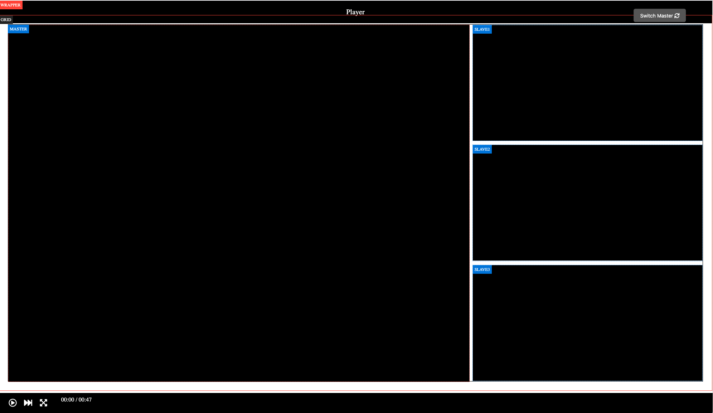

## 1. Overview
Development setup for DSVPlay.

## 2. Requirements
Requirements are best determined using Server Requirements page of corresponding Laravel 7 version
Currently used version is 7.10.3

- PHP version 7.3.*

- BCMath PHP Extension

- Ctype PHP Extension

- Fileinfo PHP extension

- JSON PHP Extension

- Mbstring PHP Extension

- OpenSSL PHP Extension

- PDO PHP Extension

- Tokenizer PHP Extension

- XML PHP Extension

- SSH access to the server

- Composer

## 3. Installation

* Make sure that composer is installed globally or install it in place

* Clone the repository

* Move into the directory. Move into the `/systemconfig` folder.

* Make sure that `/systemconfig/play.ini` file is present and configured with the configuration details for your requirements and for the server (copy play.ini.example to .ini and fill in with your data)

        [global]
        app_env=local                           ; Make sure this is set to local NOTE! For production enviroment the settings should be set to: app_env=production and app_debug=false.
        app_debug=true                          ; Make sure this is set to true
        app_url=http://localhost                ; Set this to localhost or your domain
        authorization_parameter=entitlement     ; The authorization parameter NOTE! Not used for dev enviroments
        authorization=                          ; Authorization entitlements NOTE! Not used for dev enviroments
        login_route=/login                      ; The SSO login route for your application (The production server should be set ut with this route) 
        
        [database]
        db=mysql                                ; Here you can specify which database you use: mysql, sqlite, pgsql, sqlsrv or redis 
        db_host=127.0.0.1                       ; DB host address
        db_port=3306                            ; DB port
        db_database=                            ; Database used     
        db_username=                            ; DB user
        db_password=                            ; secret
        
        
* Once the global settings are entered you can install the dependencies. `composer install`

* Make sure that .env file is present (copy .env.example to .env). 

* Either create application key manually or do that with a command `php artisan key:generate`

* Make sure the subdirectories `bootstrap/cache` and `/storage` is writable by your web server user.

* If you need to change the email configuration. Open the .env file and set the needed values

* Create the database with `php artisan migrate` (this should create database tables needed)

## 4. Player
The Player can play up to four interconnected streams simultaneously. A stream should always be in "focus" is here tagged as master. The streams that are not in focus appear as smaller display on one side of the player and are tagged slave1, slave2 and slave3. The master stream can be switched with the switch-button.

The player should have standard features:

* play / pause 
* speed 2x-6x
* time with the opportunity to jump in the movie
* full screen
* volume control

There is a common controlbar for all streams. It should be possible to hide
the unfocused displays. If the smaller displays are hidden by the user, the main display should be scaled up to take it
as much space as possible in the player window.

