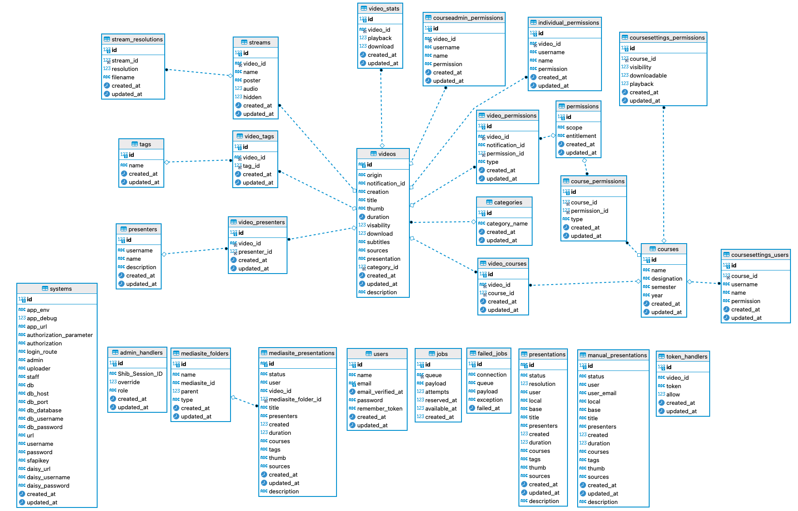

## 1. Overview
Development setup for DSVPlay.

## 2. Requirements
Requirements are best determined using Server Requirements page of corresponding Laravel 8 version

- PHP version 7.3.*

- BCMath PHP Extension

- Ctype PHP Extension

- Fileinfo PHP extension

- JSON PHP Extension

- Mbstring PHP Extension

- OpenSSL PHP Extension

- PDO PHP Extension

- Tokenizer PHP Extension

- XML PHP Extension

- SSH access to the server

- Composer

## 3. Installation

* Make sure that composer is installed globally or install it in place

  * Clone the repository

    * Move into the directory. Move into the `/systemconfig` folder.

      * Make sure that `/systemconfig/play.ini` file is present and configured with the configuration details for your requirements and for the server (copy play.ini.example to .ini and fill in with your data)

              [global]
              app_env=local                           ; Make sure this is set to local NOTE! For production enviroment the settings should be set to: app_env=production and app_debug=false.
              app_debug=true                          ; Make sure this is set to true
              app_url=http://localhost                ; Set this to localhost or your domain
              authorization_parameter=entitlement     ; The authorization parameter NOTE! Not used for dev enviroments
              authorization=                          ; Authorization entitlements NOTE! Not used for dev enviroments
              login_route=/login                      ; The SSO login route for your application (The production server should be set ut with this route) 
              default_presentation_permission='false' ; If the presentation should be public or respect the entitlents setting
              default_presentation_entitlement='entitlemnts xxxx;xxxxx'
        
              [database]
              db=mysql                                ; Here you can specify which database you use: mysql, sqlite, pgsql, sqlsrv or redis 
              db_host=127.0.0.1                       ; DB host address
              db_port=3306                            ; DB port
              db_database=                            ; Database used     
              db_username=                            ; DB user
              db_password=                            ; secret
        
              [jwt]
              jwt_secret=                             ; used to sign your token
              jwt_public_key=                         ; A path or resource to your public key. E.g. 'file://path/to/public/key'
              jwt_private_key=                        ; A path or resource to your private key. E.g. 'file://path/to/private/key'
              jwt_passphrase=                         ; The passphrase for your private key. Can be null if none set.
        
              [ticket]                                ; Tickethandler credentials
              email=
              password=
  
              [mediasite]                             ; Mediasite API
              url =
              username =
              password =
              sfapikey =
        
              [Daisy]                                 ; Daisy API
              url =
              username =
              password =
              from_year=2019                          ; Starting year to load courses
              to_year=2022                            ; Until year to load courses
        
              [sftp]                                  ; sFTP settings storage server
              host=
              username=
              privateKey=
              pk-password=

              [store]
              base_uri=                               ; Base-Uri storage server
              notify_uri=                             ; Notify Uri storage server
              list_uri=                               ; Presentations listings and delete uri storage server
              notify_auth=                            ; Password

              [sukat]                                 ; SUKAT OpenLDAP account credentials
              host=
              username=
              password=
              port=636
              base_dn=
              timeout=5
              version=3

              [recorders]                             ; Cattura Recorders
              FriendlyName = recorder.dns.name
              OtherRecorder = other.name
        
* Once the global settings are entered you can install the dependencies. `composer install`

* Make sure that .env file is present (copy .env.example to .env). If you are setting up a dev enviroment add the following settings to the .env file:

    FFMPEG_BINARIES=/usr/local/bin/ffmpeg
    FFPROBE_BINARIES=/usr/local/bin/ffprobe
    LOG_CHANNEL=daily
    LDAP_CACHE=true
  

* Either create application key manually or do that with a command `php artisan key:generate`

* Make sure the subdirectories `bootstrap/cache` and `/storage` is writable by your web server user.

* If you need to change the email configuration. Open the .env file and set the needed values

* Create the database with `php artisan migrate` (this should create database tables needed)

* For developing purposes there are a couple of seeders to run. Reset (rollback) the migration and run `php artisan migrate:fresh --seed`

## 4. API
Issued valid tokens are stored in the play.ini file (/systemconfig). There are tokens for storing new presentations and for retrieving presentation metadata (not yet fully implemented).

Endpoints for storing presentations:

Verb | URI | Action
-----|-----|-------
POST | /api/recordings | Add a new json file for the presentation (requires a token with permission=store)
GET | /api/recordings | Request a list of all presentations in json format (requires a token with permission=read)

Endpoints for checking presentation permissions:

Verb | URI | Action
-----|-----|-------
POST | /api/perm | Check user permission for presentation

Endpoints for issuing/destroying tokens:

Verb | URI | Action
-----|-----|--------
POST | /api/token_store | Issue a token with permission to store a presentation
POST | /api/token_read | Issue a token with permission to read
POST | /api/destroy | Destroy token sent

To issue a new token you have to POST to the /api/token_store or /api/token_read endpoint with valid credentials,
e.g.

    {

        "email": "server@dsv.su.se",
        "password": "password"
    }

The response:

    {

        "access_token": "eyJhbGciOiJIUzI1NiIsInR5cCI6IkpXVCJ9.eyJzdWIiO7E2cBab30RMHrHDcEfxjoYZgeFONFh7HgQ",
        "token_type": "bearer"
       
    }

## 5. Database

## 6. Player
The Player can play up to four interconnected streams simultaneously.

